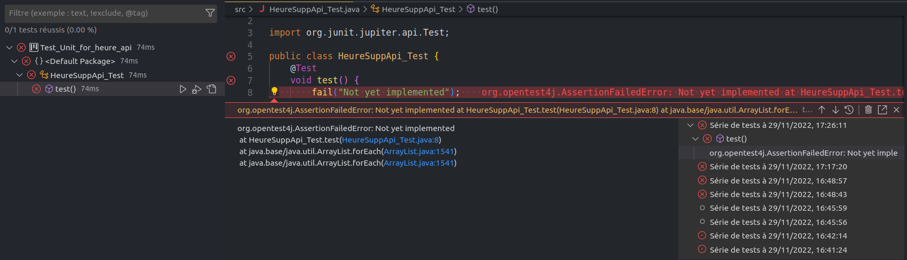

# HeureSup Test 

Projet de test pour la couche business heure supp du projet gestion des heure supp des employee

## Dépendances

* IDE :  Visual Studio Code
* Java project : java 11, Java Extension pack
* Test framework : Junit Test Jupiter,junit-platform-console-standalone
* Api: .Jar 
## Mise en place de l'environnement de Test 

### Création du project de Test

Créer un java project avec une `structure` : lib, src, bin dans vscode 

dependances associés à cette étape:
* vscode 
* java extention pack
* jre/jdk 11

### Installation des Librairies de Test et ajout de l'api à tester

dependances associés à cette étape:

* Junit Test Jupiter 
* Junit platform console standalone

Dans java project de vscode ajouter l'api à tester :

* `Refenced Librairies` > `+` Add Jar Librairies to Project classpath > `Select` Jar Librairie

* Acceder à `Test` de vscode > activer l'exécution du test junit avec jupiter : automaticaquement vscode téléchargera les librairies de test : 
[junit-platform-console-standalone](test-lib/junit-platform-console-standalone-1.9.1.jar) dans le dossier `test-lib`.

## Test d'utilisabilité de l'environnement de test

Créer une simple methode de test fail à éxecuter pour voir si il fonctionne

Félicitation l'environement fonctionne bien !

## Test unitaire 

* test sur le constructeur reussi 
* test sur la methode de calcul de heuresup echoué 
